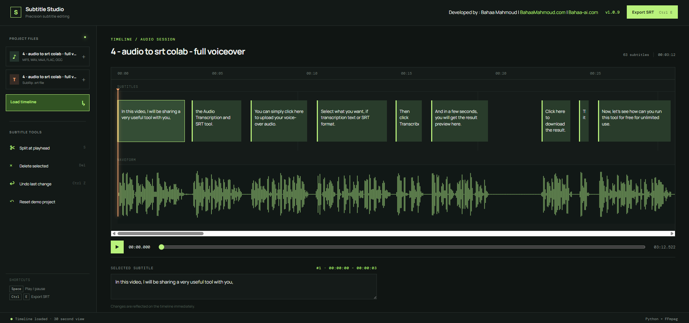

# Subtitle Studio

Subtitle Studio is a browser-based SRT subtitle editor for editing subtitle text and timing against an audio waveform. Load an audio file and an SRT file into the timeline, adjust cue boundaries, split cues at the playback needle, undo edits, and export the finished SRT file.

## Features

- Audio timeline with a decoded waveform and playback controls
- SRT cue loading, text editing, selection, and export
- Mouse-based cue edge resizing with neighboring-cue limits
- Cue splitting at the exact timeline needle position
- Playhead seeking and snapping while adjusting cue boundaries
- Undo for text, timing, split, and delete changes
- Reset with confirmation
- Browser-based editing with a Windows batch launcher
- Uses Python and bundled FFprobe without Node.js or Electron

## Requirements

- Windows for the included batch launcher
- Python 3 for the local backend
- A modern web browser

The application uses the `python` command from `PATH`. No Node.js, npm, Electron, or local package installation is required.

FFprobe is already included in the project files at `ffmpeg/ffprobe.exe`; users do not need to install it separately.

## Run in a browser

Double-click [`Subtitle_Studio.bat`](Subtitle_Studio.bat). The launcher starts the local Python service and opens the editor at `http://127.0.0.1:47821` in the default browser. Keep the batch window open while using the editor.

The launcher uses the browser file picker for audio and SRT files and downloads the edited SRT directly.

## Basic workflow

1. Choose an audio file.
2. Choose an SRT file.
3. Select **Load timeline**.
4. Select a subtitle cue to edit its text.
5. Drag the selected cue's left or right edge to adjust its timing.
6. Move the playback needle and choose **Split at playhead** to cut a cue.
7. Use **Undo last change** when needed.
8. Choose **Export SRT** to save the edited subtitle file.

## Developed by

**Bahaa Mahmoud**

- Website: [Bahaa-ai.com](https://bahaa-ai.com)
- YouTube: [Bahaa Mahmoud YouTube channel](https://www.youtube.com/channel/UC8wDA7h1hPLfr5UrPnB9r8g/)

## License

No license has been selected for this repository yet. Add a license file before publishing if you want others to reuse or redistribute the project.
